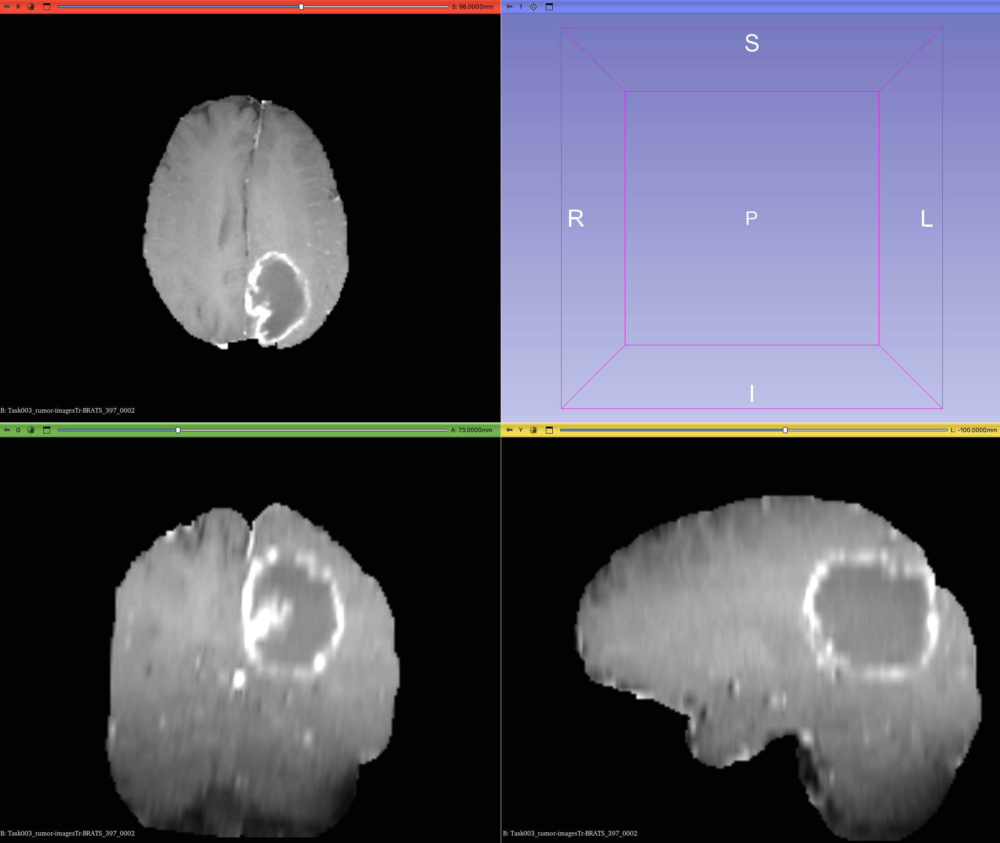
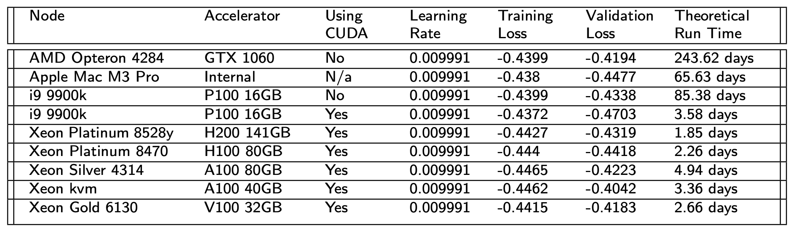
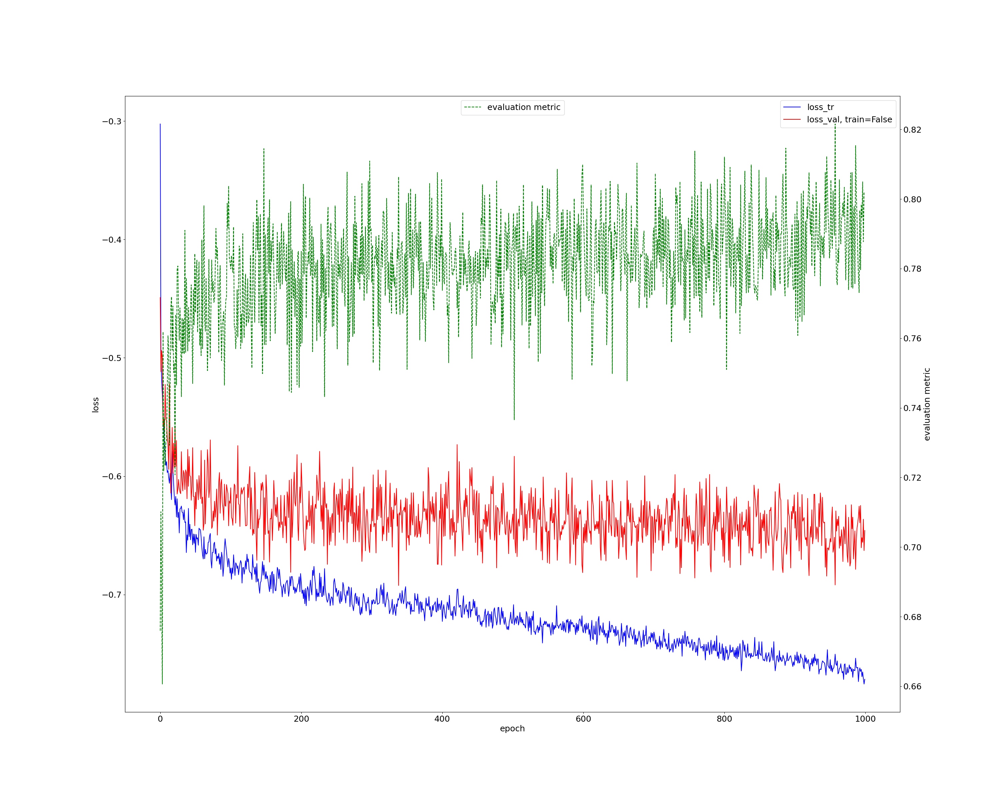
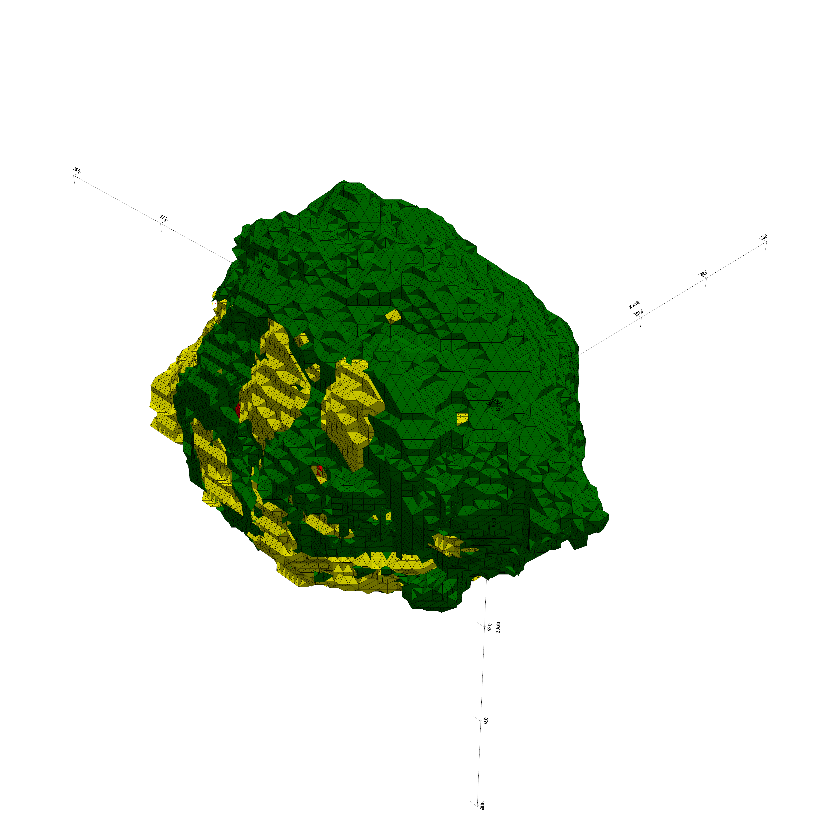
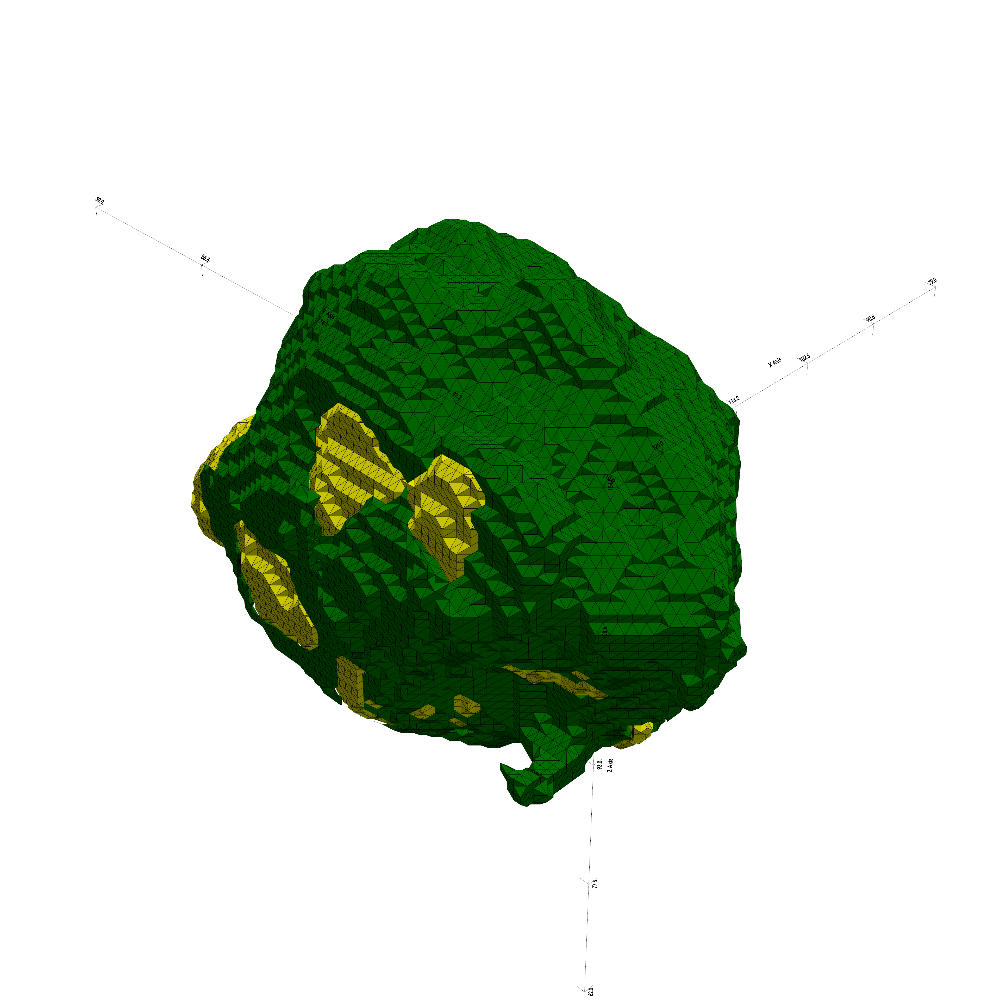

#  Tutorial: Using Transformers to Segment Glioblastoma Multiforme (GBM)


DOI: [10.7937/TCIA.T905-ZQ20](https://www.cancerimagingarchive.net/collection/glis-rt/)

A fork of the [UNETR++](https://github.com/Amshaker/unetr_plus_plus/) repo after training on a [dual socket xeon](https://www.intel.com/content/www/us/en/products/sku/120485/intel-xeon-gold-6140-processor-24-75m-cache-2-30-ghz/specifications.html) with [nvidia graphics](https://www.techpowerup.com/gpu-specs/tesla-p100-pcie-16-gb.c2888). Some modifications, including a new eval script. 

### Acknowledgements:
* Prof. Marios Patichis (UNM)
* Prof. Manel Martínez-Ramón (UNM)
* Prof. Christos Christodoulou (UNM)
* Prof. Matthew Fricke (UNM)
* James Snover (Siemens Healthineers)

## Visualizing Data/ Custom Datasets:

Download [3D Slicer Here](https://download.slicer.org).



Shown above is case study ``BRATS_397.nii.gz``.


## Installing:


Clone this repo and copy the data:

```bash
git clone --depth=10 https://github.com/keixthb/unet_gbm.git ~/unet_gbm/
git clone --depth=1 https://lobogit.unm.edu/keithhbova1/DATASET_Tumor.git ~/unet_gbm/DATASET_Tumor
```

Note that ```https://lobogit.unm.edu/keithhbova1/DATASET_Tumor.git``` is an archive of the [UNETR++ BRATS DATASET](https://mbzuaiac-my.sharepoint.com/:u:/g/personal/abdelrahman_youssief_mbzuai_ac_ae/EaQOxpD2yE5Btl-UEBAbQa0BYFBCL4J2Ph-VF_sqZlBPSQ?e=DFY41h). After downloading all the files, you can build dependencies:

```bash
python3.12 -m venv env
source !$/bin/activate
pip cache purge
pip install --upgrade pip setuptools wheel build
pip install batchgenerators==0.21
pip install torchvision==0.20.0
pip install monai numpy argparse matplotlib typing tqdm fvcore simpleitk medpy nibabel timm einops pandas pyvista nibabel
```

Alternatively, if that fails, try:

```bash
python3.12 -m venv env
source !$/bin/activate
pip cache purge
pip install --upgrade pip setuptools wheel build
pip install -r requirements.txt
```

## Re-training:

Directory structure should look something like:

```console
keithhbova@Keiths-MacBook-Pro unet_gbm % tree
.
├── assets/...
├── DATASET_Tumor/...
├── LICENSE
├── README.md
├── requirements.txt
├── run_me/...
├── unetr_plus_plus/...
└── unetr_pp/...
```

To retrain:


```bash
rm -r ~/unet_gbm/output_tumor/
cd ~/unet_gbm/run_me
sh run_training_tumor.sh
```



Actual run time was 3.46 days when compiled for the CUDA memory space (without SLURM or MPI).



## Evaluation

```bash
cd ~/unet_gbm/run_me
python my_run_evaluation_impl.py
```



Shown above is the ground truth for the case study ``BRATS_397.nii.gz``.




Shown above is the prediction for case study ``BRATS_397.nii.gz``.

## References

[A comprehensive guide to 3d models for medical image segmentation](https://www.datature.io/blog/a-comprehensive-guide-to-3d-models-for-medical-image-segmentation)

[UNETR++: Delving into Efficient and Accurate 3D Medical Image Segmentation](https://github.com/Amshaker/unetr_plus_plus/)

[Swin Unet3D: a three-dimensional medical image segmentation network combining vision transformer and convolution](https://bmcmedinformdecismak.biomedcentral.com/articles/10.1186/s12911-023-02129-z)

[Comparing images using the hausdorff distance](https://ieeexplore.ieee.org/document/232073/)

[Multi-Modal Glioblastoma Segmentation: Man versus Machine](https://journals.plos.org/plosone/article?id=10.1371/journal.pone.0096873)

[Automated Glioblastoma Segmentation Based on a Multiparametric Structured Unsupervised Classification](https://journals.plos.org/plosone/article?id=10.1371/journal.pone.0125143)

[Epidemiology and Outcome of Glioblastoma](https://pubmed.ncbi.nlm.nih.gov/29251870/)

[Attaway, Sandia National Laboratories](https://top500.org/system/179777/)

[Accurate and versatile 3D segmentation of plant tissues at cellular resolution](https://elifesciences.org/articles/57613)

[GENERATION AND SEGMENTATION OF 3D MODELS OF BONE FROM CT IMAGES BASED ON 3D POINT CLOUDS](https://macsphere.mcmaster.ca/handle/11375/27270)

[MedmeshCNN - Enabling meshcnn for medical surface models](https://www.sciencedirect.com/science/article/abs/pii/S0169260721004466?via%3Dihub)

[Deep Learning for MRI Segmentation and Molecular Subtyping in Glioblastoma: Critical Aspects from an Emerging Field](https://www.mdpi.com/2227-9059/12/8/1878)

[You Only Look Once: Unified, Real-Time Object Detection](https://ieeexplore.ieee.org/document/7780460)

[Meta Detectron2](https://github.com/facebookresearch/detectron2)

[Siemens Magnetom TERRA](https://www.siemens-healthineers.com/en-us/magnetic-resonance-imaging/7t-mri-scanner/magnetom-terra)

[VastAI: Instant GPU Rentals with 24/7 Live Support](https://vast.ai)
